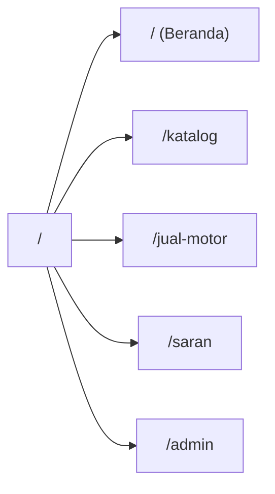
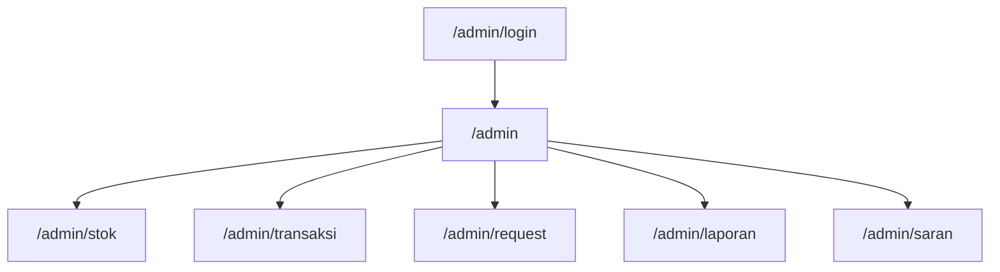

# 🏍️ Frontend Implementation Plan — Bagong Jaya Motor

## Ringkasan

Plan ini mencakup arsitektur frontend lengkap untuk website dealer motor bekas **Bagong Jaya Motor**, yang terdiri dari dua domain utama:

1. **Public Site** — Katalog motor, form jual motor, dan form saran untuk pengunjung tanpa login.
2. **Admin Dashboard** — Sistem manajemen stok, transaksi, kwitansi, dan laporan untuk admin.

Teknologi: **React 19 + Vite + Tailwind CSS + React Router DOM**

---

## User Review Required

> [!IMPORTANT]
> **Keputusan Desain Penting.** Beberapa hal di bawah ini perlu keputusan Anda sebelum eksekusi dimulai:
> 1. **Color scheme**: Apakah Anda setuju dengan dark theme premium (hitam/biru gelap) untuk public site dan light/neutral theme untuk admin?
> 2. **Bahasa antarmuka**: Apakah seluruh UI dalam Bahasa Indonesia, atau campuran (label Indonesia, kode Inggris)?
> 3. **Font**: Apakah setuju menggunakan Google Fonts **Inter** (heading) + **Plus Jakarta Sans** (body)?
> 4. **Nomor WA Admin**: Berapa nomor WhatsApp yang akan digunakan untuk tombol "Hubungi via WA"?
> 5. **Logo**: Apakah sudah ada file logo Bagong Jaya Motor, atau perlu saya generate placeholder?

---

## 1. Design System

### 1.1 Color Palette

#### Public Site (Dark Premium Theme)
| Token | Hex | Penggunaan |
|:---|:---|:---|
| `--bg-primary` | `#0A0E1A` | Background utama (deep navy) |
| `--bg-secondary` | `#111827` | Card background |
| `--bg-tertiary` | `#1F2937` | Hover states, subtle areas |
| `--accent-primary` | `#F97316` | CTA buttons, highlights (vibrant orange) |
| `--accent-secondary` | `#3B82F6` | Links, secondary actions (blue) |
| `--accent-gradient` | `linear-gradient(135deg, #F97316, #EF4444)` | Hero gradient, premium elements |
| `--text-primary` | `#F9FAFB` | Heading text (white) |
| `--text-secondary` | `#9CA3AF` | Body text (gray) |
| `--text-muted` | `#6B7280` | Caption, metadata |
| `--success` | `#10B981` | Status tersedia, success toast |
| `--danger` | `#EF4444` | Error, destructive action |
| `--border` | `rgba(255,255,255,0.08)` | Subtle card borders |

#### Admin Dashboard (Clean Light Theme)
| Token | Hex | Penggunaan |
|:---|:---|:---|
| `--admin-bg` | `#F8FAFC` | Main background |
| `--admin-sidebar` | `#0F172A` | Sidebar (dark contrast) |
| `--admin-card` | `#FFFFFF` | Card surfaces |
| `--admin-accent` | `#2563EB` | Primary action (blue) |
| `--admin-text` | `#0F172A` | Primary text |
| `--admin-text-secondary` | `#64748B` | Secondary text |

### 1.2 Typography

```
Font Primary (Headings): "Inter", sans-serif (Google Fonts, weight 600-800)
Font Secondary (Body):   "Plus Jakarta Sans", sans-serif (Google Fonts, weight 400-600)
Font Mono (Data/Code):   "JetBrains Mono", monospace (untuk tabel angka)
```

| Level | Size | Weight | Line Height |
|:---|:---|:---|:---|
| H1 (Hero) | 48px / 3rem | 800 | 1.1 |
| H2 (Section) | 32px / 2rem | 700 | 1.2 |
| H3 (Card Title) | 20px / 1.25rem | 600 | 1.3 |
| Body | 16px / 1rem | 400 | 1.6 |
| Small / Caption | 14px / 0.875rem | 400 | 1.4 |
| Badge / Tag | 12px / 0.75rem | 600 | 1 |

### 1.3 Spacing & Layout

- **Grid System**: CSS Grid + Flexbox
- **Container Max Width**: `1280px` (public), `100%` fluid (admin)
- **Spacing Scale**: Tailwind default (4px increments)
- **Border Radius**: `12px` cards, `8px` buttons, `6px` inputs, `9999px` badges
- **Box Shadows**: Layered glassmorphic shadows for public site

### 1.4 Micro-Animations

| Element | Animation | Duration |
|:---|:---|:---|
| Page transitions | Fade-in + slide-up | 300ms ease-out |
| Card hover | Scale(1.02) + shadow lift | 200ms ease |
| Button hover | Brightness(1.1) + translateY(-1px) | 150ms |
| Modal open | Backdrop fade + scale-in | 250ms cubic-bezier |
| Loading skeleton | Shimmer pulse | 1.5s infinite |
| Scroll reveal | IntersectionObserver fade-in | 400ms stagger |
| Toast notification | Slide-in from right | 300ms |
| Sidebar collapse | Width transition | 200ms ease |

---

## 2. Arsitektur Navigasi

### 2.1 Public Site — Route Structure



**Navbar (Public):**
```
┌──────────────────────────────────────────────────────────────────┐
│  🏍️ BAGONG JAYA MOTOR          Beranda  Katalog  Jual Motor  Saran │
│                                                                  │
│  [Mobile: Hamburger ☰ → Slide-in drawer dari kanan]             │
└──────────────────────────────────────────────────────────────────┘
```

- **Sticky navbar** dengan backdrop blur (glassmorphism) saat scroll
- Logo di kiri, menu items di kanan
- Active route ditandai dengan underline animasi + warna accent
- Mobile: Hamburger menu → full-screen overlay dengan animasi slide

### 2.2 Admin Dashboard — Route Structure



**Sidebar Layout (Admin):**
```
┌───────────────────────┬────────────────────────────────────────┐
│ BAGONG JAYA           │  📊 Dashboard Overview                 │
│ MOTOR                 │                                        │
│ ─────────────────     │  [Content area - scrollable]           │
│ 📊 Dashboard          │                                        │
│ 🏍️ Stok Motor         │                                        │
│ 💰 Transaksi          │                                        │
│ 📩 Request Pembelian  │                                        │
│ 📊 Laporan Excel      │                                        │
│ 💬 Saran Customer     │                                        │
│                       │                                        │
│ ─────────────────     │                                        │
│ 👤 Admin              │                                        │
│ [Logout]              │                                        │
└───────────────────────┴────────────────────────────────────────┘
```

- **Sidebar** : Fixed di desktop (240px), collapsible ke icon-only (64px)
- **Mobile**: Slide-over drawer dari kiri, overlay gelap di background
- **Top bar**: Judul halaman + greeting "Halo, Admin!" + tombol Logout
- **Active state**: Background highlight + left border accent

---

## 3. Halaman & Komponen — Detail Per Halaman

### 3.1 Beranda (Landing Page) — `/`

#### Layout:
```
┌────────────────────────────────────────────────────────────────┐
│ [Navbar - sticky, glassmorphism]                               │
├────────────────────────────────────────────────────────────────┤
│                                                                │
│  ┌──── HERO SECTION ───────────────────────────────────────┐   │
│  │  Background: gradient overlay on motorcycle image       │   │
│  │                                                         │   │
│  │  "Temukan Motor Bekas                                   │   │
│  │   Berkualitas di Sini"                   (animated text) │   │
│  │                                                         │   │
│  │  Subheading: "Showroom terpercaya dengan ..."           │   │
│  │                                                         │   │
│  │  [🔍 Lihat Katalog]  [📞 Hubungi Kami]                  │   │
│  └─────────────────────────────────────────────────────────┘   │
│                                                                │
│  ┌──── STATS BAR ──────────────────────────────────────────┐   │
│  │  🏍️ 50+ Motor Tersedia │ ⭐ 5 Tahun Pengalaman │ ✅ Garansi │
│  └─────────────────────────────────────────────────────────┘   │
│                                                                │
│  ┌──── STOK TERBARU (Grid 3 kolom) ───────────────────────┐   │
│  │  Section heading: "Stok Terbaru"     [Lihat Semua →]    │   │
│  │                                                         │   │
│  │  [MotorCard]  [MotorCard]  [MotorCard]                  │   │
│  │  [MotorCard]  [MotorCard]  [MotorCard]                  │   │
│  └─────────────────────────────────────────────────────────┘   │
│                                                                │
│  ┌──── CTA SECTION ───────────────────────────────────────┐   │
│  │  "Punya Motor yang Ingin Dijual?"                       │   │
│  │  [Jual Motor Anda Sekarang →]                           │   │
│  └─────────────────────────────────────────────────────────┘   │
│                                                                │
│  ┌──── FOOTER ────────────────────────────────────────────┐   │
│  │  © 2026 Bagong Jaya Motor │ Alamat │ No. Telp │ WA     │   │
│  └─────────────────────────────────────────────────────────┘   │
└────────────────────────────────────────────────────────────────┘
```

**Komponen yang akan dibuat:**
- `<Navbar />` — Sticky, glassmorphism, responsive
- `<HeroSection />` — Full-width dengan gradient overlay, animated text, dual CTA
- `<StatsBar />` — Counter animation (CountUp) saat scroll masuk viewport
- `<MotorCard />` — Reusable card: foto, merk, tipe, tahun, harga, tombol WA
- `<CTABanner />` — Gradient banner dengan call-to-action jual motor
- `<Footer />` — Info kontak, alamat, copyright

### 3.2 Katalog Motor — `/katalog`

#### Layout:
```
┌────────────────────────────────────────────────────────────────┐
│ [Navbar]                                                       │
├────────────────────────────────────────────────────────────────┤
│                                                                │
│  Page Title: "Katalog Motor"                                   │
│  Subtitle: "Temukan motor impian Anda"                         │
│                                                                │
│  ┌──── FILTER BAR ────────────────────────────────────────┐   │
│  │  [🔍 Cari merk/tipe...]  [Merk ▾]  [Tahun ▾]  [Harga ▾] │
│  └─────────────────────────────────────────────────────────┘   │
│                                                                │
│  ┌──── GRID (Responsif: 3 col desktop, 2 tab, 1 mobile) ─┐   │
│  │                                                         │   │
│  │  [MotorCard]  [MotorCard]  [MotorCard]                  │   │
│  │  [MotorCard]  [MotorCard]  [MotorCard]                  │   │
│  │  [MotorCard]  [MotorCard]  [MotorCard]                  │   │
│  │                                                         │   │
│  │  [Loading Skeleton saat fetch...]                       │   │
│  └─────────────────────────────────────────────────────────┘   │
│                                                                │
│  [Pagination: ← 1 2 3 ... →]                                  │
│                                                                │
│  ┌──── EMPTY STATE ───────────────────────────────────────┐   │
│  │  (Jika tidak ada hasil)                                 │   │
│  │  🏍️ "Tidak ada motor yang cocok"                        │   │
│  │  [Reset Filter]                                         │   │
│  └─────────────────────────────────────────────────────────┘   │
│                                                                │
│ [Footer]                                                       │
└────────────────────────────────────────────────────────────────┘
```

**Fitur utama:**
- Search bar real-time (debounced 300ms)
- Filter dropdown: Merk, Tahun, Range Harga
- Grid responsif dengan skeleton loading
- Pagination atau infinite scroll
- Empty state yang informatif

### 3.3 Jual Motor (Form) — `/jual-motor`

#### Layout:
```
┌────────────────────────────────────────────────────────────────┐
│ [Navbar]                                                       │
├────────────────────────────────────────────────────────────────┤
│                                                                │
│  ┌──── FORM CARD (Max 640px, centered) ───────────────────┐   │
│  │                                                         │   │
│  │  📤 "Jual Motor Anda"                                   │   │
│  │  "Isi formulir di bawah, kami akan menghubungi Anda."   │   │
│  │                                                         │   │
│  │  Nama Lengkap     [________________________]            │   │
│  │  Alamat           [________________________]            │   │
│  │  No. WhatsApp     [________________________]            │   │
│  │  Merk Motor       [________________________]            │   │
│  │  Tipe Motor       [________________________]            │   │
│  │  Tahun            [________]                            │   │
│  │  Harga Permintaan [________________________]            │   │
│  │  Deskripsi        [________________________]            │   │
│  │                   [________________________]            │   │
│  │                                                         │   │
│  │  Upload Foto (Maks 2MB):                                │   │
│  │  ┌──────────────────────────────────────────┐           │   │
│  │  │  📷 Klik atau drag foto motor ke sini    │           │   │
│  │  │     [preview thumbnail jika sudah ada]   │           │   │
│  │  └──────────────────────────────────────────┘           │   │
│  │                                                         │   │
│  │  [═══════ Kirim Penawaran ═══════]                      │   │
│  │                                                         │   │
│  └─────────────────────────────────────────────────────────┘   │
│                                                                │
│ [Footer]                                                       │
└────────────────────────────────────────────────────────────────┘
```

**Fitur:**
- Validasi client-side (required, format WA, max file size 2MB)
- Drag & drop file upload area dengan preview thumbnail
- Loading state pada tombol submit
- Success/Error toast notification
- Format harga otomatis (Rp X.XXX.XXX)

### 3.4 Form Saran — `/saran`

#### Layout:
```
┌────────────────────────────────────────────────────────────────┐
│ [Navbar]                                                       │
├────────────────────────────────────────────────────────────────┤
│                                                                │
│  ┌──── FORM CARD (Max 640px, centered) ───────────────────┐   │
│  │                                                         │   │
│  │  💬 "Berikan Saran Anda"                                │   │
│  │  "Masukan Anda sangat berarti untuk kami."              │   │
│  │                                                         │   │
│  │  Nama             [________________________]            │   │
│  │  Pesan / Saran    [________________________]            │   │
│  │                   [________________________]            │   │
│  │                   [________________________]            │   │
│  │                                                         │   │
│  │  [═══════ Kirim Saran ═══════]                          │   │
│  │                                                         │   │
│  └─────────────────────────────────────────────────────────┘   │
│                                                                │
│ [Footer]                                                       │
└────────────────────────────────────────────────────────────────┘
```

### 3.5 Admin Login — `/admin`

```
┌────────────────────────────────────────────────────────────────┐
│                                                                │
│         ┌──── LOGIN CARD (Centered) ─────────────────┐        │
│         │                                             │        │
│         │  🏍️ BAGONG JAYA MOTOR                       │        │
│         │  Panel Admin                                │        │
│         │                                             │        │
│         │  Username   [____________________]          │        │
│         │  Password   [____________________] 👁️       │        │
│         │                                             │        │
│         │  [═══════ Masuk ═══════]                    │        │
│         │                                             │        │
│         │  [← Kembali ke Beranda]                     │        │
│         └─────────────────────────────────────────────┘        │
│                                                                │
│  Background: blurred gradient / motorcycle silhouette          │
└────────────────────────────────────────────────────────────────┘
```

### 3.6 Admin Dashboard — `/admin/dashboard`

```
┌────────────┬───────────────────────────────────────────────────┐
│  SIDEBAR   │  Header: "Dashboard" │ Halo, Admin! │ [Logout]    │
│            ├───────────────────────────────────────────────────┤
│  📊 Dash   │                                                   │
│  🏍️ Stok   │  ┌─────────┐ ┌─────────┐ ┌─────────┐ ┌────────┐ │
│  💰 Trans  │  │ Stok    │ │ Terjual │ │ Request │ │ Saran  │ │
│  📩 Req    │  │ 24 unit │ │ 12 bln  │ │ 5 baru  │ │ 8 baru │ │
│  📊 Lap    │  │ ↗ +3    │ │ ini     │ │         │ │        │ │
│  💬 Saran  │  └─────────┘ └─────────┘ └─────────┘ └────────┘ │
│            │                                                   │
│            │  ┌──── Transaksi Terakhir ───────────────────┐   │
│ ─────────  │  │ ID │ Tipe │ Tanggal │ Klien │ Nominal     │   │
│ 👤 Admin   │  │ ...│ ...  │ ...     │ ...   │ ...         │   │
│ [Logout]   │  └───────────────────────────────────────────┘   │
└────────────┴───────────────────────────────────────────────────┘
```

**Summary Cards:** 4 kartu metrik dengan ikon, angka besar, dan perubahan dari bulan sebelumnya.

### 3.7 Admin — Stok Motor — `/admin/stok`

- Tabel data dengan kolom: ID, Foto (thumbnail), Merk, Tipe, Tahun, Harga, Status, Aksi
- Tombol `[+ Tambah Motor]` membuka modal form
- Modal form: input merk, tipe, tahun, harga, upload foto, status (Tersedia/Terjual)
- Aksi per baris: Edit (modal), Hapus (confirm dialog), Toggle Status
- Search bar + filter status

### 3.8 Admin — Transaksi — `/admin/transaksi`

- Tabel: ID, Tipe (Jual/Beli badge), Tanggal, Klien, Motor, Nominal, Aksi
- Badge berwarna: Jual = hijau, Beli = biru
- Tombol `[+ Tambah Transaksi]` → Modal form
- Form fields: Tipe (radio Jual/Beli), ID Motor (dropdown), Nama Klien, Nominal, Tanggal
- Tombol `[🖨️ Cetak Kwitansi]` per baris → trigger `react-to-print`

### 3.9 Admin — Kwitansi (Print Template)

```
┌────────────────────────────────────────────────────────────────┐
│                     KWITANSI                                   │
│              BAGONG JAYA MOTOR                                 │
│         Jl. Contoh No. 123, Kota XYZ                           │
│  ──────────────────────────────────────────────────────────    │
│  No. Kwitansi  : KW-2026-001                                  │
│  Tanggal       : 7 April 2026                                 │
│                                                                │
│  Telah terima dari : Budi Santoso                              │
│  Uang sejumlah     : Rp 12.000.000                             │
│  Terbilang         : (Dua belas juta rupiah)                   │
│  Untuk pembayaran  : Honda Beat 2020 (Plat N 1234 AB)         │
│  ──────────────────────────────────────────────────────────    │
│                                                                │
│                                        Petugas,               │
│                                                                │
│                                        _______________         │
│                                        (Admin)                 │
└────────────────────────────────────────────────────────────────┘
```

- Komponen hidden `<ReceiptTemplate ref={printRef} />` 
- Trigger via `react-to-print` → buka dialog print browser
- CSS `@media print` untuk formatting khusus cetak

### 3.10 Admin — Request Pembelian — `/admin/request`

- Tabel daftar penawaran motor dari form publik `/jual-motor`
- Kolom: ID, Nama Pengirim, No. WA, Merk/Tipe, Tahun, Harga, Foto (klik untuk enlarge), Tanggal
- Tombol `[📱 Hubungi via WA]` per baris → buka WhatsApp
- Modal preview foto full-size

### 3.11 Admin — Laporan — `/admin/laporan`

- Filter bulan/tahun (dropdown)
- Preview tabel ringkasan: Total Jual, Total Beli, Selisih
- Tombol `[📥 Download Excel]` → generate `.xlsx` via `xlsx` library
- Kolom Excel: ID, Tipe, Tanggal, Klien, Motor, Nominal

### 3.12 Admin — Saran Customer — `/admin/saran`

- Tabel: ID, Nama, Pesan, Tanggal
- Read-only view, admin bisa menghapus saran

---

## 4. Struktur Folder Frontend

```
frontend/
├── public/
│   └── favicon.ico
├── src/
│   ├── assets/              # Gambar, ikon statis
│   │   └── images/
│   ├── components/          # Komponen reusable
│   │   ├── ui/              # Primitives (Button, Input, Modal, Badge, Toast)
│   │   │   ├── Button.jsx
│   │   │   ├── Input.jsx
│   │   │   ├── Modal.jsx
│   │   │   ├── Badge.jsx
│   │   │   ├── Toast.jsx
│   │   │   ├── Card.jsx
│   │   │   ├── Table.jsx
│   │   │   ├── Dropdown.jsx
│   │   │   ├── FileUpload.jsx
│   │   │   └── Skeleton.jsx
│   │   ├── public/          # Komponen khusus public site
│   │   │   ├── Navbar.jsx
│   │   │   ├── Footer.jsx
│   │   │   ├── HeroSection.jsx
│   │   │   ├── StatsBar.jsx
│   │   │   ├── MotorCard.jsx
│   │   │   └── CTABanner.jsx
│   │   └── admin/           # Komponen khusus admin
│   │       ├── Sidebar.jsx
│   │       ├── AdminHeader.jsx
│   │       ├── SummaryCard.jsx
│   │       ├── ReceiptTemplate.jsx
│   │       ├── MotorFormModal.jsx
│   │       └── TransactionFormModal.jsx
│   ├── layouts/             # Layout wrappers
│   │   ├── PublicLayout.jsx    # Navbar + Outlet + Footer
│   │   └── AdminLayout.jsx     # Sidebar + Header + Outlet
│   ├── pages/               # Route pages
│   │   ├── public/
│   │   │   ├── HomePage.jsx
│   │   │   ├── CatalogPage.jsx
│   │   │   ├── SellMotorPage.jsx
│   │   │   └── SuggestionPage.jsx
│   │   └── admin/
│   │       ├── LoginPage.jsx
│   │       ├── DashboardPage.jsx
│   │       ├── StockPage.jsx
│   │       ├── TransactionPage.jsx
│   │       ├── RequestPage.jsx
│   │       ├── ReportPage.jsx
│   │       └── SuggestionAdminPage.jsx
│   ├── hooks/               # Custom hooks
│   │   ├── useAuth.js
│   │   ├── useToast.js
│   │   └── useDebounce.js
│   ├── services/            # API call functions
│   │   ├── api.js           # Axios instance + base config
│   │   ├── motorService.js
│   │   ├── transactionService.js
│   │   ├── authService.js
│   │   └── reportService.js
│   ├── utils/               # Utility functions
│   │   ├── formatCurrency.js
│   │   ├── formatDate.js
│   │   ├── terbilang.js     # Angka → kata (untuk kwitansi)
│   │   └── excelExport.js
│   ├── context/             # React Context
│   │   └── AuthContext.jsx
│   ├── router/              # Route configuration
│   │   └── index.jsx
│   ├── styles/
│   │   └── print.css        # @media print styles
│   ├── App.jsx
│   ├── main.jsx
│   └── index.css            # Tailwind directives + custom CSS vars
├── index.html
├── tailwind.config.js
├── vite.config.js
├── postcss.config.js
└── package.json
```

---

## 5. Routing & Protected Routes

```jsx
// router/index.jsx — Simplified structure
const router = createBrowserRouter([
  {
    element: <PublicLayout />,     // Navbar + Footer wrapper
    children: [
      { path: "/", element: <HomePage /> },
      { path: "/katalog", element: <CatalogPage /> },
      { path: "/jual-motor", element: <SellMotorPage /> },
      { path: "/saran", element: <SuggestionPage /> },
    ],
  },
  {
    path: "/admin",
    element: <LoginPage />,       // Standalone login (no layout)
  },
  {
    path: "/admin",
    element: <ProtectedRoute><AdminLayout /></ProtectedRoute>,
    children: [
      { path: "dashboard", element: <DashboardPage /> },
      { path: "stok", element: <StockPage /> },
      { path: "transaksi", element: <TransactionPage /> },
      { path: "request", element: <RequestPage /> },
      { path: "laporan", element: <ReportPage /> },
      { path: "saran", element: <SuggestionAdminPage /> },
    ],
  },
]);
```

**`<ProtectedRoute />`**: Mengecek token JWT di localStorage. Jika tidak ada / expired, redirect ke `/admin`.

---

## 6. Responsive Breakpoints

| Breakpoint | Width | Layout Behavior |
|:---|:---|:---|
| Mobile | < 640px | 1 kolom, hamburger menu, full-width cards |
| Tablet | 640–1024px | 2 kolom grid, condensed sidebar |
| Desktop | > 1024px | 3 kolom grid, full sidebar |

**Prioritas Mobile-First**: Semua style dimulai dari mobile, lalu di-extend ke atas.

---

## 7. Dependencies Frontend

```json
{
  "dependencies": {
    "react": "^19.x",
    "react-dom": "^19.x",
    "react-router-dom": "^7.x",
    "react-to-print": "^3.x",
    "xlsx": "^0.18.x",
    "file-saver": "^2.x",
    "axios": "^1.x",
    "react-icons": "^5.x",
    "react-hot-toast": "^2.x"
  },
  "devDependencies": {
    "tailwindcss": "^4.x",
    "@tailwindcss/vite": "^4.x",
    "autoprefixer": "^10.x",
    "postcss": "^8.x",
    "vite": "^6.x"
  }
}
```

---

## 8. Rencana Eksekusi (Phased Roadmap)

### Fase 1: Foundation (Hari 1)
- [ ] Setup project Vite + React + Tailwind CSS
- [ ] Konfigurasi design tokens (CSS variables di index.css)
- [ ] Setup routing (React Router DOM)
- [ ] Buat komponen UI primitif: Button, Input, Modal, Badge, Toast, Card
- [ ] Buat PublicLayout (Navbar + Footer)
- [ ] Buat AdminLayout (Sidebar + Header)

### Fase 2: Public Pages (Hari 2-3)
- [ ] HomePage — Hero, StatsBar, Motor Grid, CTA Banner
- [ ] CatalogPage — Filter, Grid, Pagination, Empty State
- [ ] SellMotorPage — Form + File Upload + Validasi
- [ ] SuggestionPage — Form sederhana
- [ ] Generate gambar hero banner & placeholder motor

### Fase 3: Admin Pages (Hari 4-5)
- [ ] LoginPage — Form login + auth flow
- [ ] DashboardPage — Summary cards + recent transactions
- [ ] StockPage — Tabel CRUD + Modal form
- [ ] TransactionPage — Tabel + Form + Cetak Kwitansi
- [ ] RequestPage — Tabel request + preview foto
- [ ] ReportPage — Filter bulan + export Excel
- [ ] SuggestionAdminPage — Read-only list

### Fase 4: Polish (Hari 6)
- [ ] Micro-animations (scroll reveal, hover effects, transitions)
- [ ] Responsive testing (mobile, tablet, desktop)
- [ ] Loading states & skeleton screens
- [ ] Error handling & toast notifications
- [ ] Print CSS untuk kwitansi

---

## Open Questions

> [!IMPORTANT]
> **Butuh jawaban sebelum memulai coding:**

1. **Nomor WhatsApp Admin** — Nomor berapa yang digunakan untuk tombol "Hubungi via WA"?
2. **Alamat Showroom** — Alamat lengkap untuk ditampilkan di footer dan kwitansi?
3. **Logo** — Apakah sudah ada file logo, atau perlu saya buatkan placeholder?
4. **Tailwind CSS versi** — PRD menyebut Tailwind CSS. Apakah setuju dengan **Tailwind v4** (terbaru)?
5. **Color scheme approval** — Apakah Anda setuju dengan dark premium theme untuk public site + light theme untuk admin?
6. **Backend API** — Apakah backend/API sudah ada atau belum? Jika belum, frontend akan menggunakan mock data/dummy terlebih dahulu.

---

## Verification Plan

### Automated Tests
- Jalankan `npm run build` untuk memastikan tidak ada error compile
- Jalankan `npm run dev` dan test setiap route di browser
- Test responsiveness di berbagai viewport (360px, 768px, 1280px)

### Manual Verification
- Screenshot setiap halaman untuk visual review
- Test flow: buka beranda → lihat katalog → klik WA → isi form jual motor → submit
- Test admin flow: login → lihat dashboard → CRUD stok → buat transaksi → cetak kwitansi → export laporan
- Test print kwitansi di browser print dialog
- Cross-browser test (Chrome, Firefox)
